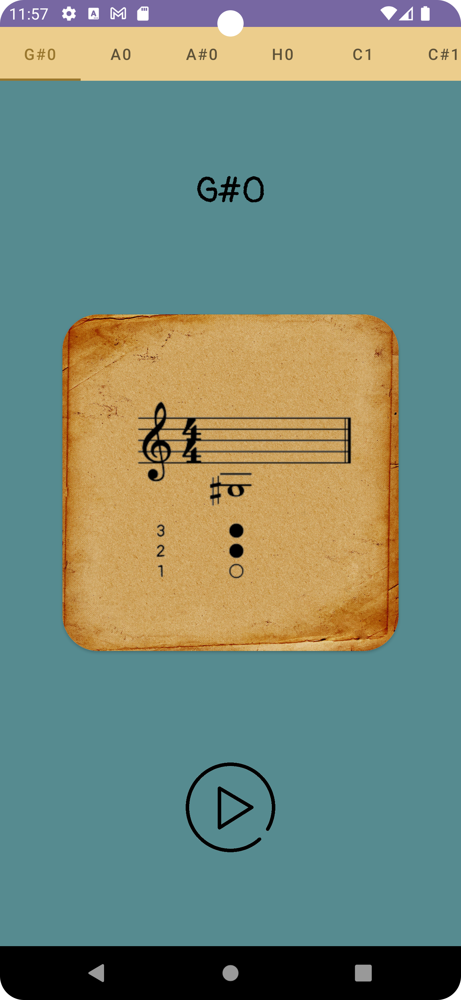

<!-- PROJECT LOGO -->
<div align="center">
  <a href="https://github.com/vlmrkv/TrumpetABC">
    
  </a>

<h3 align="center">Trumpet ABC</h3>

  <p align="center">
    An awesome mobile application-assistant for trumpet players.
    <br />
    <br />
    <a href="https://github.com/vlmrkv/TrumpetABC">View Demo</a>
    ·
    <a href="https://github.com/vlmrkv/TrumpetABC/issues">Report Bug</a>
    ·
    <a href="https://github.com/vlmrkv/TrumpetABC/issues">Request Feature</a>
  </p>
</div>


<!-- ABOUT THE PROJECT -->

## About The Project

A mobile application-assistant that help to learn play trumpet.

### Features:

- Basic fingerings for trumpet
- All tones for daily exercises
- Note's cards with playing sound
- Userfrieldly UI
- Multi-language support

</br>

### Built With

* Single Activity
* [Fragments](https://developer.android.com/guide/fragments)
* [Jetpack Navigation](https://developer.android.com/guide/navigation) - for simple navigation
  between screens

</br>

<!-- GETTING STARTED -->

## Getting Started

### Installation

1. Open Android Studio
2. Select the menu item "File" -> "New" -> "Project from Version Control"
3. Clone the repo
   ```sh
   git clone https://github.com/vlmrkv/TrumpetABC.git
   ```

</br>

<!--Demo -->

# Demo

## Screens

  

</br>

<!-- ROADMAP -->

## Roadmap

- [x] Add English language support
- [ ] Add Metronome
- [ ] Add Tuner

See the [open issues](https://github.com/vlmrkv/TrumpetABC/issues) for a full list of proposed
features (and known issues).

</br>


<!-- CONTRIBUTING -->

## Contributing

Contributions are what make the open source community such an amazing place to learn, inspire, and
create. Any contributions you make are **greatly appreciated**.

If you have a suggestion that would make this better, please fork the repo and create a pull
request. You can also simply open an issue with the tag "enhancement".
Don't forget to give the project a star! Thanks again!

1. Fork the Project
2. Create your Feature Branch (`git checkout -b feature/AmazingFeature`)
3. Commit your Changes (`git commit -m 'Add some AmazingFeature'`)
4. Push to the Branch (`git push origin feature/AmazingFeature`)
5. Open a Pull Request

</br>

## License

- The images are licensed under the [CC BY 4.0 License](https://creativecommons.org/licenses/by/4.0/)
- App's code is licensed under the [MIT License](https://opensource.org/licenses/mit-license.html/)

</br>

## Contact

[Telegram](https://t.me/vlmrkv)
[Yandex mail](mailto:markov@mdvlpr.ru)

<br />